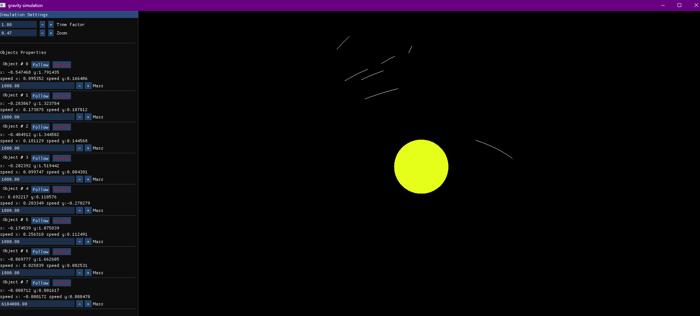
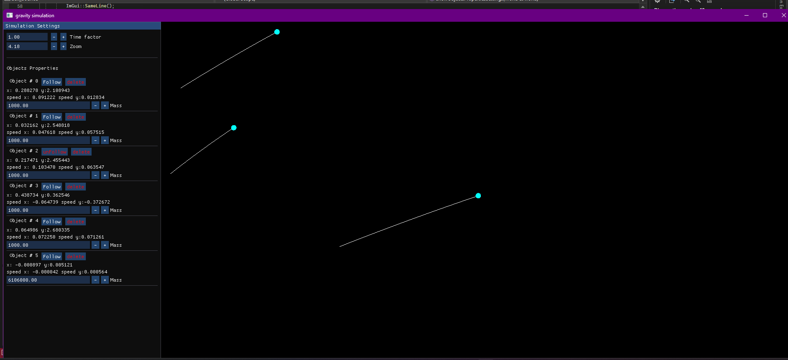

# Gravity Simulation Engine (N-Body)

A high-performance 2D physics engine built from scratch using **C++** and **OpenGL**. This project simulates gravitational attraction between celestial bodies using Newton’s Law of Universal Gravitation, featuring real-time orbital tracing, mass merging, and an interactive control dashboard.



## Features

* **N-Body Physics Simulation:** Accurate calculation of gravitational forces between multiple objects using $F = G \frac{m_1 m_2}{r^2}$.
* **Dynamic Orbital Paths:** Real-time visualization of trajectories for every moving body using dynamic Vertex Buffers.
* **Collision & Merging Logic:** Realistic merging of bodies upon impact; mass and momentum are conserved, and the radius is dynamically recalculated.
* **Advanced Camera Controls:** * **Follow Mode:** Lock and track specific objects as they move through space.
    * **Smooth Zoom & Pan:** Interactive navigation using mouse scroll and drag.
* **Modern OpenGL Pipeline:** Utilizes **Instanced Rendering** for optimized performance and `glBufferSubData` for high-frequency position updates.
* **Interactive UI:** Powered by **Dear ImGui** to modify simulation parameters (Time Factor, Mass, Velocity) on the fly.

## Tech Stack

* **Language:** C++17
* **Graphics API:** OpenGL 3.3 (Core Profile)
* **Libraries:** * [GLFW](https://www.glfw.org/) (Window & Input)
    * [GLAD](https://glad.dav1d.de/) (OpenGL Loading)
    * [Dear ImGui](https://github.com/ocornut/imgui) (User Interface)
    * [GLM](https://github.com/g-truc/glm) (Mathematics)

##  Screenshots

| Simulation Overview | UI Controller & Object Properties |
| :---: | :---: |
|  |  |

## Technical Architecture

### 1. Physics Integration
The simulation uses a discrete time-step integration. In each frame:
1.  **Force Accumulation:** Each body calculates the gravitational pull from all other active bodies.
2.  **Velocity Update:** $v = v + a \cdot \Delta t$
3.  **Position Update:** $p = p + v \cdot \Delta t$

### 2. Rendering Strategy
* **Instancing:** A single circle mesh is defined in a VAO, and all planets are drawn in one call using `glDrawArraysInstanced`.
* **Data Buffering:** Masses, positions, and colors are sent to the GPU as instance attributes, minimizing CPU-GPU overhead.

## ⚙️ Installation & Setup

1.  **Clone the repository:**
    ```bash
    git clone [https://github.com/yourusername/gravity-simulation.git](https://github.com/yourusername/gravity-simulation.git)
    cd gravity-simulation
    ```

2.  **Dependencies:**
    Ensure you have `GLFW` and `OpenGL` development headers installed on your system.

3.  **Assets:**
    Make sure the following shader files are in your executable directory:
    * `shader.vert` / `shader.frag` (For bodies)
    * `path.vert` (For orbital lines)

4.  **Build:**
    Compile using your preferred IDE (VS Code with CMake or MSVC).

## 🎮 Controls
* **Left Mouse Drag:** Pan through the universe.
* **Scroll Wheel:** Zoom in/out.
* **UI Panel:** * Click **Follow** to lock the camera on an object.
    * Adjust **Time Factor** to speed up or slow down the simulation.
    * Modify **Mass** to see real-time changes in gravity and size.

---

Developed with ❤️ using C++ and OpenGL.
