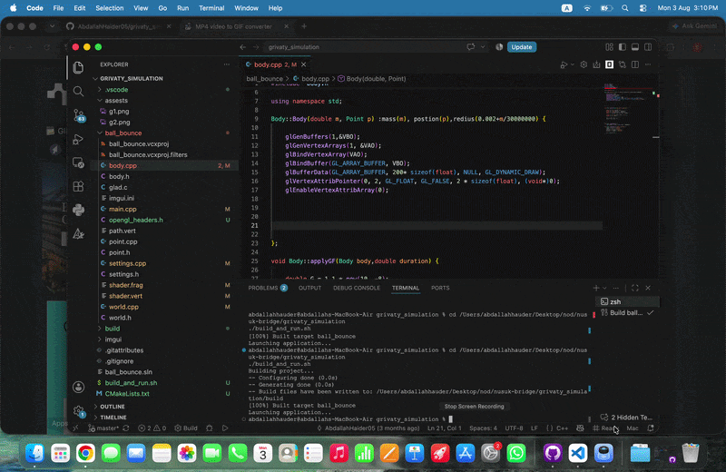

# Gravity Simulation Engine (N-Body)

A high-performance 2D physics engine built from scratch using **C++** and **OpenGL**. This project simulates gravitational attraction between celestial bodies using Newton’s Law of Universal Gravitation, featuring real-time orbital tracing, mass merging, and an interactive control dashboard.

## Features

* **N-Body Physics Simulation:** Accurate calculation of gravitational forces between multiple objects using $F = G \frac{m_1 m_2}{r^2}$.
* **Dynamic Orbital Paths:** Real-time visualization of trajectories for every moving body using dynamic Vertex Buffers.
* **Collision & Merging Logic:** Realistic merging of bodies upon impact; mass and momentum are conserved, and the radius is dynamically recalculated.
* **Advanced Camera Controls:** * **Follow Mode:** Lock and track specific objects as they move through space.
    * **Smooth Zoom & Pan:** Interactive navigation using mouse scroll and drag.
* **Modern OpenGL Pipeline:** Utilizes **Instanced Rendering** for optimized performance and `glBufferSubData` for high-frequency position updates.
* **Interactive UI:** Powered by **Dear ImGui** to modify simulation parameters (Time Factor, Mass, Velocity) on the fly.

## Tech Stack

* **Language:** C++17
* **Graphics API:** OpenGL 3.3 (Core Profile)
* **Libraries:** * [GLFW](https://www.glfw.org/) (Window & Input)
    * [GLAD](https://glad.dav1d.de/) (OpenGL Loading)
    * [Dear ImGui](https://github.com/ocornut/imgui) (User Interface)
    * [GLM](https://github.com/g-truc/glm) (Mathematics)

##  Screenshots

| Simulation Overview | UI Controller & Object Properties |
| :---: | :---: |
|  |  |

Developed by abdallah haider using C++ and OpenGL.
